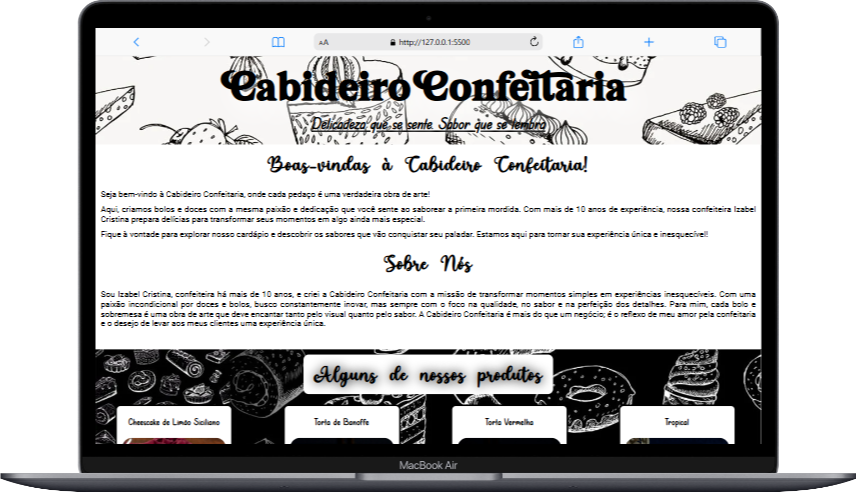

# Confeitaria

O intuito deste repositório é desenvolver um site de forma criativa, não podendo ser clone de outro site e usando as técnias do HTML e CSS. No exposto, foi criado um site de uma confeitaria. 

    
    

## Site proposto: Cabideiro Confeitaria

- [x]  Estrutura HTML
- [x] Organizando arquitetura de projetos font 
    - assetes
        - img
        - fonts
- [x] Realizando primeiro commit
    - responsividade
    
- [x] Estilo inicial CSS
    - CSS
        - header
        - main
        - footer
- [x] Enviando ao github